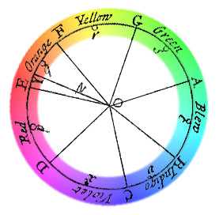
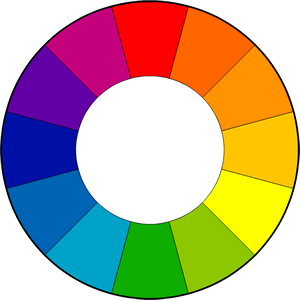
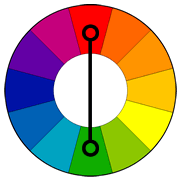
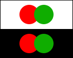
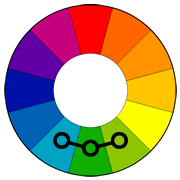
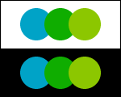
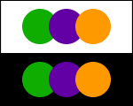
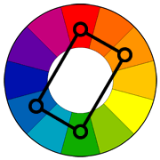
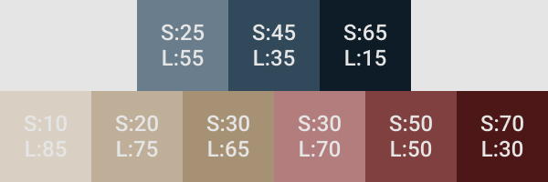
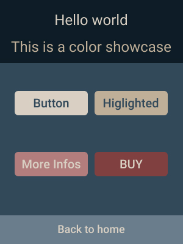

# Les couleurs
## (Théorie des couleurs & utilisation pour la conception d'Interfaces Utilisateurs)

---

## Généralités
Les couleurs sont fondamentales dans toute réalisation d'une interface utilisateur.

Elles peuvent servir, par exemple, à **définir une ambiance** ou **attirer l'attention**.

En sélectionnant les bonnes couleurs, on peut créer une ambiance _élégante_, _chaleureuse_ ou _calme_. 

Enfin, elles peuvent être l'un des éléments de design les plus efficaces !

***

### La roue des couleurs
Historiquement, l'une des premières théories sur les couleurs nous vient d'Isaac Newton, qui a défini qu'elles sont un mélange de lumières **rouges**, **vertes** et **bleues**. 

Il produisit, de cette théorie, la 1ère "roue des couleurs" :

***

### Evolution des systèmes de couleurs
Comme vu précédemment, le premier système de couleur est basé sur la lumière, avec une base RGB. Il en existe d'autres, qui ont différentes utilisations : 
- **CMY** pour l'impression : Cyan, Magenta, Yellow.
- **RYB** pour la peinture : Red, Yellow, Blue.

***

### La roue "classique"

La roue des couleurs a pour but de fournir des couleurs qui se combinent bien ensemble. 

Même s'il y a eu de nombreuses variations avec le temps, la version la plus commune est une roue de 12 couleurs, basée sur le modèle **RYB**, tel que suit :

***

### Couleurs primaires, secondaires et tertiaires
Dans le modèle RYB, les couleurs primaires sont : rouge, jaune et bleu.

Les couleurs secondaires (vert, orange et violet) sont obtenues par un mélange de certaines couleurs primaires.

Enfin, d'autres couleurs, dites tertiaires, sont obtenues par un mélange de couleur primaire et de couleur secondaire.

***

### Couleurs dites "chaudes" et "froides"
La roue des couleurs peut être séparée en ces 2 catégories.

Les couleurs **chaudes** sont dites vives et énergiques, alors que les couleurs **froides** donnent une impression de calme ou d'apaisement.

_(En outre, le blanc, le noir et le gris sont dites neutres.)_

***

### Signification des couleurs
Les couleurs ont des **significations**, il faut les sélectionner **en accord avec le thème ou l'ambiance**.

| Couleur | Signification |
| --------|---------------|
| Rouge   | énergie, passion, chaleur / sang, guerre, danger   |
| Jaune   | joie, optimisme / trahison, jalousie        |
| Vert    | nature, santé, jeunesse / inexperience, envie |
| Violet  | spiritualité, mystère, connaissance |
| Orange  | équilibre, vitalité, automne / désir, domination |

_Liste des significations sur [color-symbolism](https://www.wordpress-web-designer-raleigh.com/2015/04/color-in-web-design-color-symbolism/)_

---

## Harmonie des couleurs
Techniques basiques pour choisir un ensemble de couleurs.

***

### Couleurs complémentaires
Les couleurs dites "complémentaires" sont des couleurs **opposées** sur la roue.

Le **contraste** entre ces deux couleurs permet, par exemple, de bien faire ressortir une information.

_Note : il est difficile de les utiliser en grande mesure, il faut donc restreindre leur utilisation à des cas précis._

***

### Couleurs dites "analogues"
Ce schéma utilise des couleurs **très proches** sur la roue.

De fait, elles sont **assez ressemblantes**, et vont souvent **s'accorder correctement**, elles sont également dites harmonieuses et plaisantes à l'oeil.

***

### Triade de couleurs
Ce schéma utilise trois couleurs qui ont un **espacement égal et fixe** sur la roue.

Généralement, **le contraste** qui en ressort **est assez vif**, il faut donc sélectionner les couleurs avec attention.

_Note : Il existe une variante qui sélectionne 2 couleurs secondaires plus proches sur la roue._

***

### Rectangle de couleurs
Ce schéma utilise quatres couleurs arrangées en **paires de couleurs complémentaires**.

Il permet plus de **possibilités et de variations**.

_Note : Il existe une variante qui est un carré, il utilise donc un espace égal et fixe entre les couleurs._

***

### Notes sur les harmonies

* Utilisez une **couleur principale**, et d'autres pour l'accompagner. 

* Vérifiez qu'il y a **assez de contraste** entre les couleurs.

* Veillez à l'équilibre entre couleurs chaudes et froides.

---

## Système de couleurs avancé : HSB

***

### Le modèle HSB
**HSB** : Hue-Saturation-Brightness

(où _Hue_ signifie **teinte** et _Brightness_ signifie **luminosité**.)

Ce modèle est généralement plus compréhensible pour l'humain que le RGB, car les concepts de saturation et luminosité permettent de mieux saisir la **nature** d'une couleur, plutôt que par une combinaison de valeurs RGB.

___

_Détaillons ce modèle!_

***

### La teinte (Hue)
La teinte est représentée par un nombre de 0° à 360° (en degrés).

_Vous souvenez-vous de la roue des couleurs?_

La teinte est donc le **positionnement** sur la roue!

_Ici, nous n'avons pas de variation plus sombre/claire... c'est la qu'interviennent les autres composantes._

***

### La saturation
Représentée par un **pourcentage** de 0 à 100.

On peut voir la saturation comme la **quantité de couleur injectée dans le gris**.

- Saturation à 100% : couleur à son maximum de richesse.
- Saturation à 0% : version grise de cette couleur.

***

### La luminosité (brightness) - 1
Représentée par un **pourcentage** de 0 à 100, qui détermine **l'intensité de lumière émise**.

Sa compréhension est un peu plus "complexe" que la saturation, voyez donc :
- Luminosité à 0% : donne du **noir**. Peu importe la teinte ou la saturation.
- Luminosité à 100% : rend la couleur à sa **"brillance"** maximum. Elle donnera du blanc seulement SI la saturation est également à 0% (remember, car saturation à 0% donne la version grise de la couleur).

***

### La luminosité (brightness) - 2
Confus? Prenons un exemple!
Imaginons la luminosité comme une **ampoule** :
- 0% de luminosité = ampoule éteinte -> salle dans le noir.
- 100% de luminosité = ampoule au maximum -> salle fortement éclairée par la **couleur de la lumière**. ET SI la lumière est blanche, la luminosité sera 100% blanche.

***

### Synthèse du modèle HSB
Ainsi, avec ce modèle, nous pouvons décrire une couleur avec 3 valeurs : 

- **Teinte** (Hue) : de 0° à 360°, couleur donnée par la **position sur la roue**.
- **Saturation** : de 0 à 100%, quelle **quantité de couleur "pure"** injectée.
- **Luminosité** (Brightness) : de 0 à 100%, **l'intensité** de la lumière émise. 

---

## Variations de couleurs

***

### Variations de couleurs : selon le modèle HSB

Pour obtenir des variations de couleurs, il est commun de "jouer" avec les différents composantes de ce modèle. Tout d'abord avec la **teinte** : 

- Si l'on déplace la **position sur la roue**, on obtient des couleurs différentes, on peut ainsi avoir des variantes d'une couleur principale.

_(Mais tel quel, il n'est pas si aisé de trouver des couleurs qui s'accordent...)_

***

### Variations de couleurs : saturation et luminosité

Pour obtenir une **variation claire** : 
- Baisser la saturation
- Augmenter la luminosité

Pour une **variation foncée**, on fait l'inverse : 
- Augmenter la saturation
- Baisser la luminosité

***

### Exemple
En partant d'une **couleur principale**, et en effectuant les actions citées à la slide précédente, on peut obtenir des variations de cette dernière qui **s'accordent bien** : 

---

## Les palettes de couleurs

***

### Pourquoi utiliser une palette de couleur ?

- Limite le nombres de couleurs, cela **cadre la réalisation**.

- Permet de mettre en avant la **couleur principale** (pour le branding, ou l'ambiance du site, par exemple).

- Ajoute de la **consistance** au design (fondamental!)

***

### Palette de couleur pour le web design
Voyons ce qu'il nous faut pour une **palette assez complète** : 
- **Identité** : 1 couleur principale, 1 à 2 couleurs secondaires, ainsi que leurs variantes claires/foncées.

- **Call-to-action** : 1 couleur, dont le **contraste** avec les autres doit être visible (!). Les variantes claires/foncées sont optionelles _(selon le besoin)_.

- **Messages** (optionnel) : couleurs **claires** usuelles pour les errors (rouge), success (vert), infos (bleu) et warnings (jaune).

***

### Exemple de palette simple
Couleurs et variantes : 
- **Principale** : bleu grisé 
- **Secondaire** (ici, complémentaire) : Beige 
- **CTA** : bordeau clair

***

### Utilisation de la palette
Une fois les couleurs déterminées, on peut effectuer rapidement un premier jet pour voir si les couleurs s'accordent : 

---

## Outils

- [Coolors](https://coolors.co/) : assiste la sélection de couleurs.
- [Adobe Color](https://color.adobe.com/fr/create/color-wheel/) : création d'une harmonie de couleurs.
- [Paletton](http://paletton.com/) : création de palettes plus complexes
- [Figma](https://www.figma.com/files/recent) : maquettage/prototyping
- [Webgradients](https://webgradients.com/) : dégradés pour backgrounds
- [Colorpalettes](https://colorpalettes.net/) : palettes de 5 couleurs harmonieuses