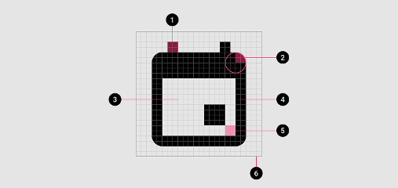
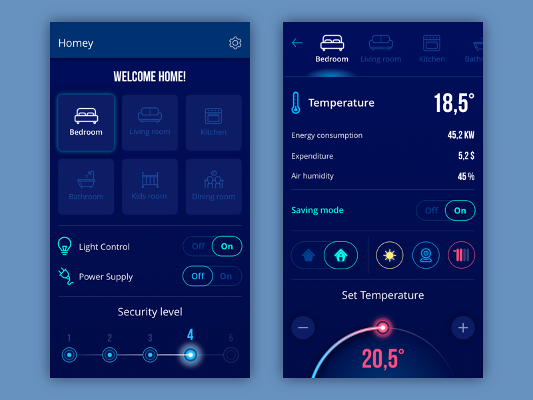
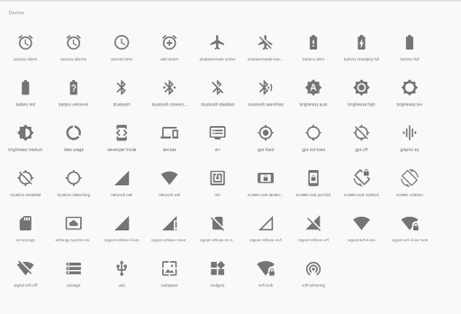
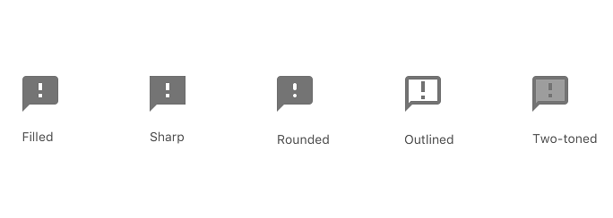
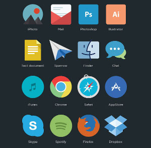
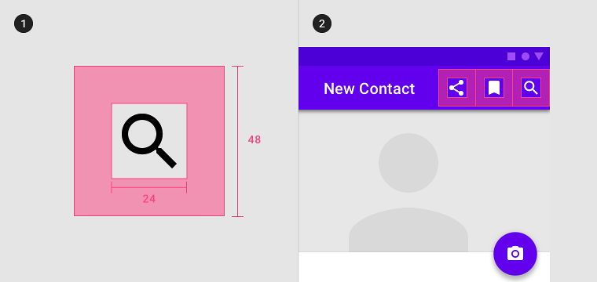

# Icônes sur le web

---

## Définition, classification & propriétés

***

### Définition
Une icône est une **représentation visuelle** d'un **objet**, d'une **action** ou d'une **idée**. 

On en dinstingue trois types principaux : 

- **Ressemblance** : décrit _(un objet ou un concept)_ directement par l'**aspect visuel**.

  

***

- **Référence** : décrit _(un objet ou un concept)_ par **référence ou analogie**.

- **Arbitraire** : décrit _(un objet ou un concept)_ par **convention** ou représente une **marque**.

***

### Propriétés des icônes

1. **Trait final**, se trouve _au-delà_ de la bordure principale.
2. **Coin**, souvent arrondi.
3. **Zone de "contre"**, représente l'intérieur de l'icône.
4. **Bordure principale**.
5. **Contre-trait**, partie interne de l'icône, opposée au coin.
6. **Zone de délimitation**.

---

## Types d'icônes - basé sur la fonction
Clarification, interactivité, décoration, branding

***

### Clarification
Ces icônes ont un but explicatif, elles **assistent le texte** pour rendre **plus rapide la captation** de l'information. 

_En accompagnant le texte, on **renforce la compréhension**._

***

### Interactivité
Elles prennent part à **l'interactivité générale** et **supportent la navigation**. 

Généralement **cliquables (ou tappables)**, elles effectuent l'action symbolisée par l'icône.

***

### Décoration & Branding
- Les icônes **décoratives** ont un rôle **plus esthétique que fonctionnel**.

- Leur style sera souvent **adapté à l'audience ciblée** et elles jouent un rôle important dans **l'attraction et la rétention** de l'utilisateur.

---

- Les icônes de **branding** sont spécifiques à une identité visuelle. 

- Elles sont souvent composées d'un logo, d'une lettre ou de la mascotte. 

---

## Types d'icônes - basé sur le style
Glyphes, Flat

***

### Les glyphes - Définition
Utilisent des **formes simplifiées et universelles** afin d'être **flexibles et reconnaissables**, elles assistent l'information et la navigation.

***

### Les glyphes - Variations de design
On retrouve ici principalement 3 types de design :

- **Filled** : intérieur rempli, couleur uniforme.
- **Outlined** : bordure principale, intérieur non rempli.
- **Two-Toned** : marquage entre la bordure principale et le centre, rempli d'une autre couleur. _(ceci peut-être spécifique au material design)_

***

### Le style "Flat"
- Ce style est généralement situé entre le **fonctionnel** et le **décoratif**. 

- Elles jouent un rôle moindre dans la navigation, mais permettent d'élaborer des **éléments visuels plus complexes**.

---

## Règles et bonnes pratiques

***

### Règles
- Ne pas **mélanger les styles d'icônes** (de façon inconsistante).

- Utiliser les icônes **les plus universelles**.

- Les icônes **ne remplacent pas le texte** !

- N'en n'abusez pas!

***

### Bonnes pratiques

- Laissez **suffisamment de place autour de chaque icônes** (notamment pour une utilisation mobile).

***

- Pour de la navigation avec des icônes :
    - **outlined** pour un élément _non actif_ 
    - **filled** pour un élément _actif_.

 

- Eviter les icônes **à plusieurs sens** (étoile, coeur, ...).

- Faire une liste des **icônes nécessaires à un projet**.

***

### Principes d'une bonne icône
Plus généralement, on reconnait plusieurs aspects à une **bonne** icône : 

- Claire
- Chargée de sens
- Reconnaissable
- Simple
- Consistante
- Etirable/Flexible
- Attractive et non-offensive

---

## Outils
- [Fontawesome](https://fontawesome.com/)
- [Material IO Icons](https://material.io/tools/icons/?style=baseline)